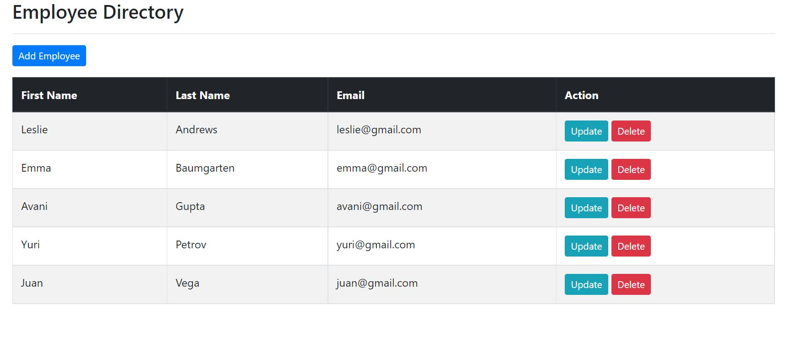
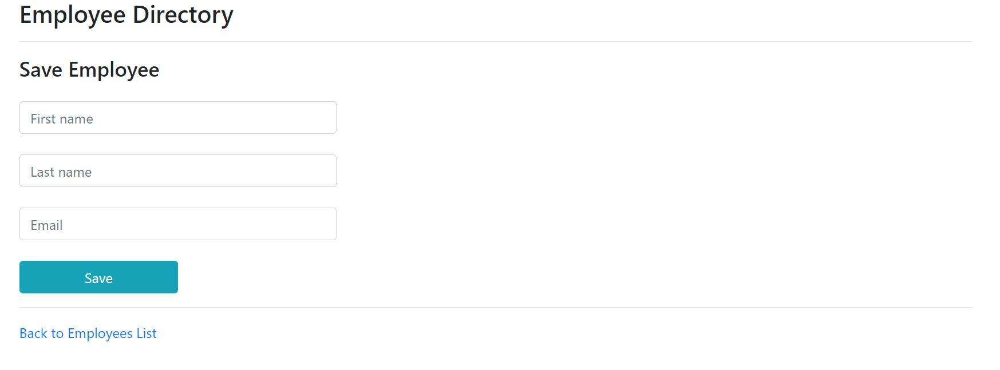

A Simple CRM UI That is used to add new employee, update and delete employee details using Spring and Hibernate framework.  

Tools Used:-
1. Intellij Idea
2. https://start.spring.io/
3. Spring Boot
4. Hibernate Framework 
